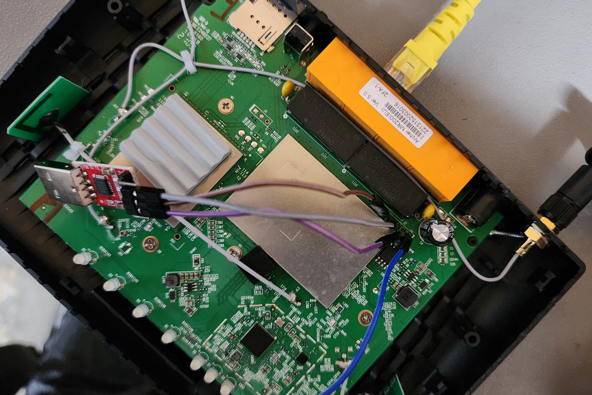
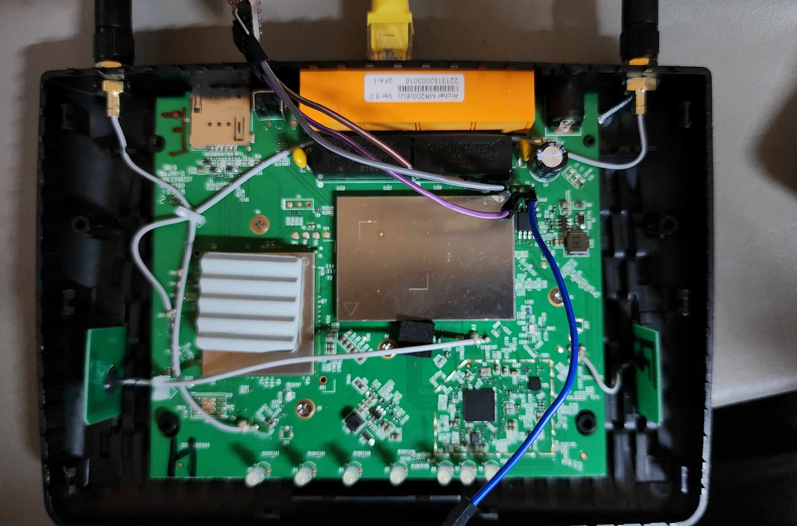

# OpenWrt Installation Guide — TP-Link Archer MR200 v5

## Device Info

| Property | Value |
|----------|-------|
| SoC | MediaTek MT7628AN |
| RAM | 64 MB DDR2 |
| Flash | 16 MB SPI (Micron, ID: 20 70 17) |
| WiFi | 2.4GHz 2x2 + 5GHz 1x1 |
| Modem | Qualcomm MDM9207 LTE |
| OpenWrt Support | Since 24.10.0 |
| Target | ramips / mt76x8 |

---

## Firmware Download

Go to: https://firmware-selector.openwrt.org  
Search: `archer mr200 v5`

Two files available:
- `openwrt-...-tplink_archer-mr200-v5-squashfs-tftp-recovery.bin` — for fresh installation
- `openwrt-...-tplink_archer-mr200-v5-squashfs-sysupgrade.bin` — for upgrading existing OpenWrt

---

## Method 1 — WPS Button + TFTP Recovery (Recommended)

This is the easiest method. No hardware modification needed.

### IP Addresses Required

| Device | IP Address |
|--------|------------|
| Your PC (LAN) | `192.168.0.225` |
| Router (bootloader) | `192.168.0.1` (auto) |
| Subnet mask | `255.255.255.0` |

### What You Need

- Windows PC with Tftpd64 installed
- Ethernet cable (PC to any LAN port on router)
- OpenWrt tftp-recovery image

### Steps

**1. Set PC IP address**

- Open Network & Internet Settings
- Click Ethernet adapter → Properties
- IPv4 Properties → Use the following IP address
- IP: `192.168.0.225`, Subnet: `255.255.255.0`, Gateway: blank
- Click OK

**2. Prepare TFTP server**

- Download Tftpd64: https://pjo2.github.io/tftpd64/
- Rename the downloaded firmware to exactly: `tp_recovery.bin`
- Open Tftpd64
- Set **Current Directory** to the folder containing `tp_recovery.bin`
- Set **Server interfaces** to `192.168.0.225` (your Ethernet adapter, NOT Bluetooth or Wi-Fi)

**3. Flash the firmware**

- Power off the router
- Connect Ethernet cable from PC to any LAN port
- Power on the router while holding the **WPS button** for ~10 seconds
- Tftpd64 log should show: `Read request for file <tp_recovery.bin>`
- Wait for transfer
- Router will flash automatically and reboot (~2-3 minutes)

**4. Verify**

- After reboot, open browser to `http://192.168.1.1`
- OpenWrt LuCI interface should appear
- Login with blank password, then set a root password immediately under **System → Administration**

---

## Method 2 — UART + U-Boot TFTP (Advanced)

Use this method if the WPS button method fails. Requires opening the router and soldering a UART header.

### Hardware Required

- USB-to-UART adapter (CP2102, CH340, or FT232 — **3.3V logic only, never 5V**)
- 3 jumper wires
- Soldering iron (if header pins not pre-installed)
- PuTTY (Windows)

### UART Pinout

Open the router. Locate the 4-pin header on the PCB. With LEDs facing left:

```
[LEDs side]
Pin 1 — TX   → connect to RX of USB adapter
Pin 2 — RX   → connect to TX of USB adapter  
Pin 3 — GND  → connect to GND of USB adapter
Pin 4 — 3V3  → leave UNCONNECTED
```

> ⚠️ Always connect TX→RX and RX→TX (crossed). Never connect 3V3 pin.

### Wiring Setup

The images below show the actual wiring setup with a USB-to-UART adapter (red board) connected to the UART header on the MR200 v5 PCB using jumper wires.




The hand-drawn diagram below illustrates the 4-pin UART header layout. The pins are labelled **TX**, **RX**, **GND**, and **VCC** (left to right). The triangle warning symbol above **VCC** indicates this pin must remain unconnected — connecting it can damage both the router and the USB adapter. Only TX, RX, and GND are used.

### PuTTY Serial Settings

| Setting | Value |
|---------|-------|
| Connection type | Serial |
| COM port | Your adapter's COM port (check Device Manager) |
| Speed (baud) | 115200 |
| Data bits | 8 |
| Stop bits | 1 |
| Parity | None |
| Flow control | None |
| Mode | Raw |

### Viewing Router Boot Details via UART

Once connected, power on the router. You will see the full boot log including:

- U-Boot version and build date
- DRAM size and configuration
- Flash chip manufacturer ID and device ID
- CPU frequency
- Boot type selection
- Kernel boot messages
- OpenWrt login prompt (once flashed)

This is useful for diagnosing boot failures, identifying flash chip, and confirming firmware is loading correctly.

### Getting into U-Boot Console

1. Open PuTTY session (serial, 115200 baud, Raw mode)
2. Power on the router
3. **Immediately and rapidly spam the `4` key** in PuTTY
4. You should see: `4: System Enter Boot Command Line Interface`
5. Then the `MT7628 #` prompt appears

### IP Addresses Required

| Device | IP Address |
|--------|------------|
| Router (U-Boot) | `192.168.0.2` (set via setenv) |
| Your PC (TFTP server) | `192.168.0.225` |
| Subnet mask | `255.255.255.0` |

### Useful U-Boot Commands

```bash
# Check all environment variables
printenv

# Check flash chip ID
spi id

# Set router IP
setenv ipaddr 192.168.0.2

# Set TFTP server IP
setenv serverip 192.168.0.225

# Download file from TFTP server to RAM
tftpboot 0x80000000 tp_recovery.bin

# Boot image from RAM address
bootm 0x80000000

# Erase flash sector (offset, length)
spi erase <offset> <length>

# Copy from RAM to flash
cp.b <src_ram_addr> <dst_flash_addr> <length>

# Reboot
reset

# Show available commands
help
help spi
```

### Flash OpenWrt via U-Boot

**Step 1 — Prepare TFTP server (same as Method 1)**
- PC IP: `192.168.0.225`
- File: `tp_recovery.bin` in Tftpd64 directory
- Tftpd64 bound to `192.168.0.225`

**Step 2 — At MT7628 # prompt, run:**

```bash
setenv ipaddr 192.168.0.2
setenv serverip 192.168.0.225
tftpboot 0x80000000 tp_recovery.bin
```

Wait for: `Bytes transferred = 8192000 (7d0000 hex)`

**Step 3 — Write to flash:**

```bash
spi erase 0x20000 0x7B0000
cp.b 0x80000000 0xBC020000 0x7B0000
reset
```

- `spi erase` takes ~30 seconds (dots will scroll)
- `cp.b` takes ~30 seconds
- Router reboots into OpenWrt after `reset`

---

## Method 3 — Upgrade via LuCI (Sysupgrade)

Use this only when OpenWrt is **already installed** and you want to update to a newer version.

1. Download the `sysupgrade.bin` file from firmware-selector
2. Log into LuCI at `http://192.168.1.1`
3. Go to **System → Backup/Flash Firmware**
4. Click **Flash image**, upload the sysupgrade file
5. Uncheck "Keep settings" for a clean upgrade
6. Click **Continue** and wait for reboot (~3 minutes)

---

## Post-Installation Setup

1. Open browser → `http://192.168.1.1`
2. Login (blank password first time)
3. Go to **System → Administration** → set root password
4. Go to **System → Software** → `opkg update` to refresh package list
5. Configure WiFi under **Network → Wireless**
6. Configure WAN under **Network → Interfaces** (default uses LTE modem as WAN)

---

## Troubleshooting

| Problem | Cause | Fix |
|---------|-------|-----|
| Tftpd64 not receiving connection | Wrong PC IP or wrong interface selected | Set PC to 192.168.0.225, select correct adapter in Tftpd64 |
| `Starting kernel...` hangs | Something error | Wait up to 10 minutes, if still same proceed to reflash |
| WPS method not working | Wrong PC IP or Tftpd64 bound to wrong adapter | Ensure PC is 192.168.0.225, Tftpd64 on same adapter |

---

## Notes

- Always use the adapter's **LAN ports** for TFTP, never the WAN port